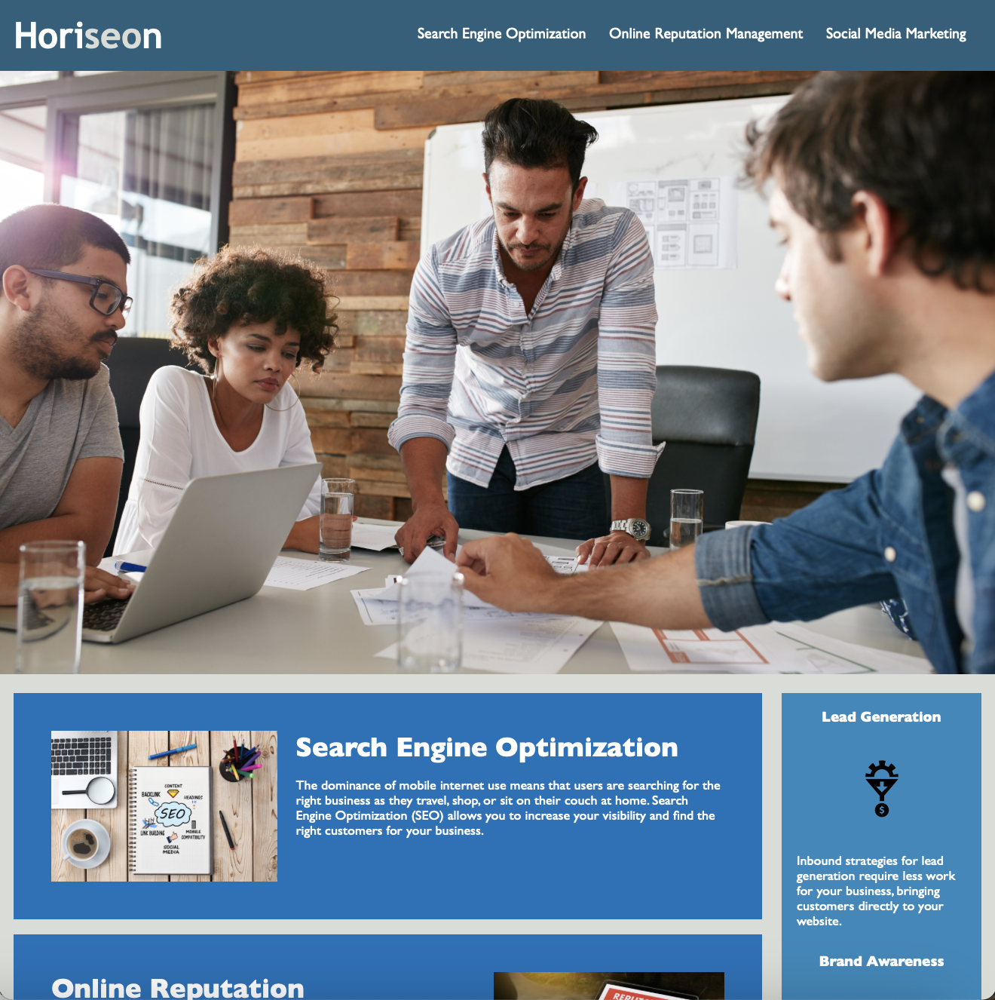
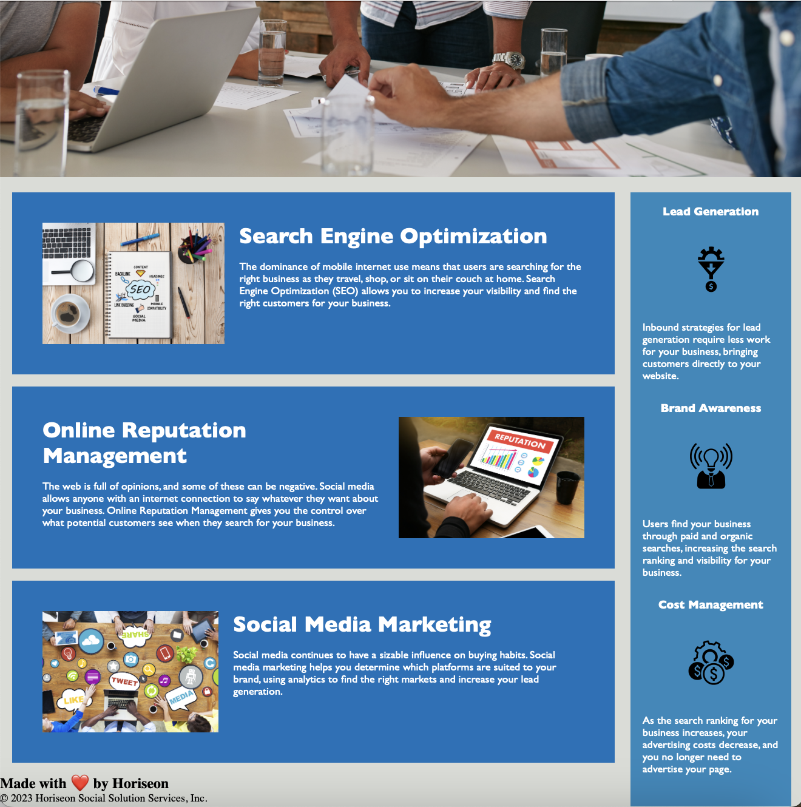

# Code Refractor

***Refractor a marketing agency's existing site to make it more accessible.***

  [](mailto:emilysiimone11@gmail.com) 

[Description](#description) • [Usage](#usage) • [Support](#support) • [Credits](#credits) • [License](#license)


## Description

[Back to Top](#code-refractor)

For this project, I applied skills pertaining to HTML, CSS, and Git to enhance the starter code of a marketing agency’s existing site to make it more accessible. Web accessibility is an increasingly important consideration for businesses, as it ensures that people with disabilities can access a website using assistive technologies, such as video captions, image texts, screen readers, and braille keyboards.

Specifically, I implemented code **refractor** to improve the site - without changing its functionality - and to meet the acceptance criteria provided for this on-the-job ticket. I ensured that the codebase is set for long-term sustainability by making sure that all of the links are functioning correctly. In addition, I adhered to the **Scout Rule**, which recommends that you always leave the code a little cleaner than when you found it. I did this by including comments before each element or section of the page to help better explain what the code does. I also reworked the CSS to make it more efficient by consolidating CSS selectors and properties and organized them to follow the semantic structure of the HTML elements.

### User Story

```
AS A marketing agency

I WANT a codebase that follows accessibility standards

SO THAT our own site is optimized for search engines
```

### Acceptance Criteria

```
GIVEN a webpage meets accessibility standards

WHEN I view the source code

THEN I find semantic HTML elements

WHEN I view the structure of the HTML elements

THEN I find that the elements follow a logical structure independent of styling and positioning

WHEN I view the icon and image elements

THEN I find accessible alt attributes

WHEN I view the heading attributes

THEN they fall in sequential order

WHEN I view the title element

THEN I find a concise, descriptive title
```

## Usage

[Back to Top](#code-refractor)

This on-the-job ticket allowed me to implement new skills and refractor code. To impress clients, it is always best practice to go the extra mile and improve the codebase for long-term sustainability by ensuring the website functions properly and is best structured for efficiency and long-term use. The project allowed me to enhance accessibility features, such as alternate text for images on the website. Having an accessible website is crucial, as it better positions the site in search engines, and it can help companies avoid litigation that can otherwise occur when people with disabilities are unable to access the company's website.

### Visuals





## Support

[Back to Top](#code-refractor)

If you have any questions, or additional feedback, please feel free to contact me. I will get back to you as soon as possible.

*Contact Information:*

GitHub: [emsim11](https://github.com/emsim11)

Email: emilysiimone11@gmail.com

*Submit an Issue:*

If you are experiencing an issue with this application, please submit an [issue ticket](https://github.com/emsim11/Code-Refractor/issues).

## Credits

Here are listed the sources that helped make this project possible.

### Authors

*The following developers helped create this project:*

[Emily Simone](https://github.com/emsim11) - Main Developer

## License

&copy; 2024 Emily Simone

This application is licensed under the [MIT License](./LICENSE).